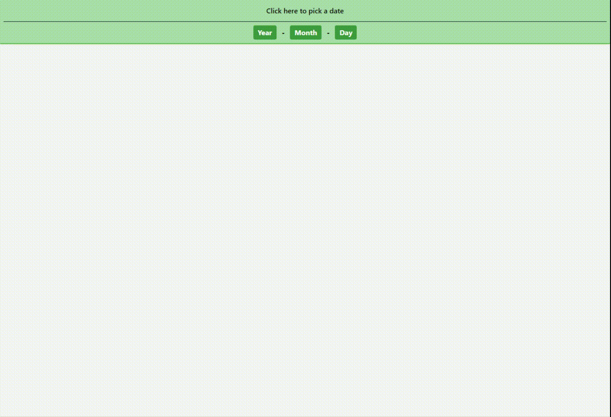

# UXDatepicker

Too many datepickers have the standard "Calendar" format of picking dates. You have to use a combination of typing the year (or clicking on a number scroller), 
then using a dropdown to select the month, then using a calendar to pick the day.

That's 3 separate interaction mechanics that users have to combine in order to do something as simple as pick a date. Picking dates that are potentially decades in the past, 
like a birthday or historical date, are even worse as users have to scroll long lists of years or click one year at a time on a scroller.

There's a better way. What if you could choose a date consistently using just 5 clicks?

Well, now you can.

